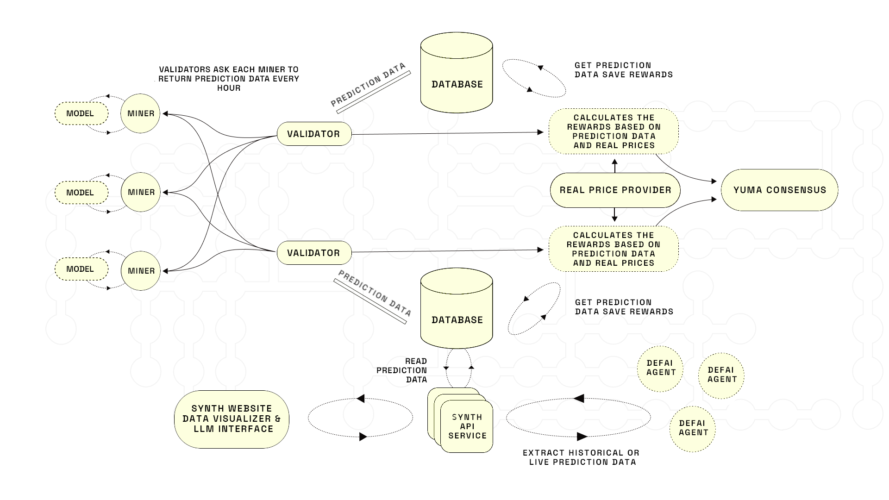
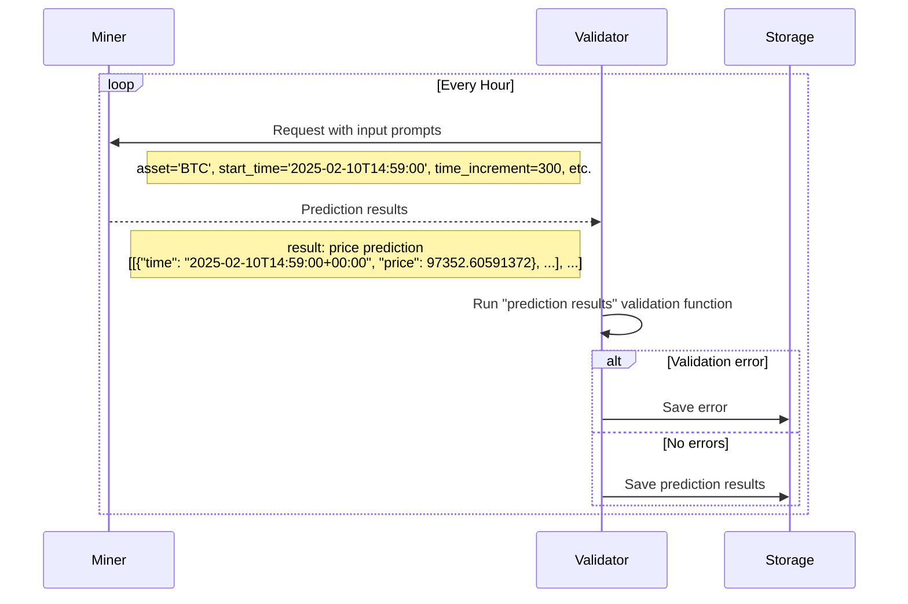
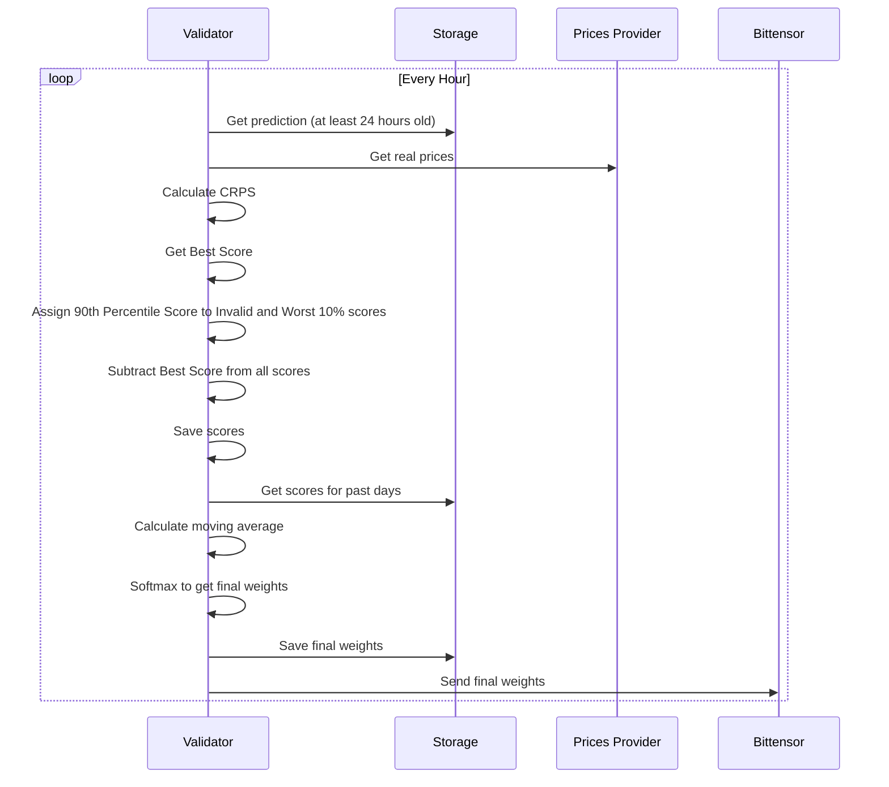

<div align="center">
  <a href="https://www.synthdata.co/">
    
  </a>
</div>

<h1 align="center">
    Synth Subnet
</h1>

<div align="center">
    <a href="https://www.synthdata.co" target="_blank">
        <b>Website</b>
    </a>
·
    <a href="https://github.com/mode-network/synth-subnet/blob/main/Synth%20Whitepaper%20v1.pdf" target="_blank">
        <b>Whitepaper</b>
    </a>
·
    <a href="https://discord.gg/gnt8sFMdg6" target="_blank">
        <b>Discord</b>
    </a>
·
    <a href="https://api.synthdata.co/docs" target="_blank">
        <b>API Documentation</b>
    </a>
</div>

---

<div align="center">

[][license]

</div>

---

### Table of contents

- [1. Overview](#-1-overview)
  - [1.1. Introduction](#11-introduction)
  - [1.2. Task Presented to the Miners](#12-task-presented-to-the-miners)
  - [1.3. Validator's Scoring Methodology](#13-validators-scoring-methodology)
  - [1.4. Calculation of Leaderboard Score](#14-calculation-of-leaderboard-score)
  - [1.5. Overall Purpose](#15-overall-purpose)
- [2. Usage](#-2-usage)
  - [2.1. Miners](#21-miners)
    - [2.1.1. Tutorial](#211-tutorial)
    - [2.1.2. Reference](#212-reference)
  - [2.2. Validators](#22-validators)
  - [2.3. Develop](#23-develop)
- [3. License](#-3-license)

## 🔭 1. Overview

### 1.1. Introduction

The Synth Subnet leverages Bittensor’s decentralized intelligence network to create the world's most powerful synthetic data for price forecasting. Unlike traditional price prediction systems that focus on single-point forecasts, Synth specializes in capturing the full distribution of possible price movements and their associated probabilities, to build the most accurate synthetic data in the world.

Miners in the network are tasked with generating multiple simulated price paths, which must accurately reflect real-world price dynamics including volatility clustering and fat-tailed distributions. Their predictions are evaluated using the Continuous Ranked Probability Score (CRPS), which measures both the calibration and sharpness of their forecasts against actual price movements.

Validators score miners on short-term and long-term prediction accuracy, with recent performance weighted more heavily through an exponential decay function. Daily emissions are allocated based on miners’ relative performance, creating a competitive environment that rewards consistent accuracy.

<div align="center">
    
</div>

Figure 1.1: Overview of the synth subnet.

The Synth Subnet aims to become a key source of synthetic price data for AI Agents and the go-to resource for options trading and portfolio management, offering valuable insights into price probability distributions.

<sup>[Back to top ^][table-of-contents]</sup>

### 1.2. Task Presented to the Miners



Miners are tasked with providing probabilistic forecasts of a cryptocurrency's future price movements. Specifically, each miner is required to generate multiple simulated price paths for an asset, from the current time over specified time increments and time horizon. Initially all checking prompts will be to produce 100 simulated paths for the future price of bitcoin at 5-minute time increments for the next 24 hours. As of November 13, 2025, the network has been upgraded to request that miners produce 1000 simulated paths for the future price of BTC, ETH, SOL, and XAU for the next 24 hours. This upgrade reflects Synth’s commitment to developing high frequency trading capabilities.

Whereas other subnets ask miners to predict single values for future prices, we’re interested in the miners correctly quantifying uncertainty. We want their price paths to represent their view of the probability distribution of the future price, and we want their paths to encapsulate realistic price dynamics, such as volatility clustering and skewed fat tailed price change distributions. Subsequently we’ll expand to requesting forecasts for multiple assets, where modelling the correlations between the asset prices will be essential.

If the miners do a good job, the Synth Subnet will become the world-leading source of realistic synthetic price data for training AI agents. And it will be the go-to location for asking questions on future price probability distributions - a valuable resource for options trading and portfolio management.

The checking prompts sent to the miners will have the format:
(start_time, asset, time_increment, time_horizon, num_simulations)

Initially prompt parameters will always have the following values:

- **Start Time ($t_0$)**: 1 minute from the time of the request.
- **Asset**: BTC, ETH, XAU, SOL (note that CRPS for each asset contributes equally to final miner weights).
- **Time Increment ($\Delta t$)**: 5 minutes.
- **Time Horizon ($T$)**: 24 hours.
- **Number of Simulations ($N_{\text{sim}}$)**: 1000.

Validators will alternate between sending out requests for BTC and ETH predictions, at 30min intervals. The miner has until the start time to return ($N_{\text{sim}}$) paths, each containing price predictions at times given by:

$$
t_i = t_0 + i \times \Delta t, \quad \text{for }\, i = 0, 1, 2, \dots, N
$$

where:

- $N = \dfrac{T}{\Delta t}$ is the total number of increments.

We recommend the miner sends a request to the Pyth Oracle to acquire the price of the asset at the start_time.

If they fail to return predictions by the start_time or the predictions are in the wrong format, they will be scored 0 for that prompt.

<sup>[Back to top ^][table-of-contents]</sup>

### 1.3. Validator's Scoring Methodology

The role of the validators is, after the time horizon as passed, to judge the accuracy of each miner’s predicted paths compared to how the price moved in reality. The validator evaluates the miners' probabilistic forecasts using the Continuous Ranked Probability Score (CRPS). The CRPS is a proper scoring rule that measures the accuracy of probabilistic forecasts for continuous variables, considering both the calibration and sharpness of the predicted distribution. The lower the CRPS, the better the forecasted distribution predicted the observed value.

#### Application of CRPS to Ensemble Forecasts

In our setup, miners produce ensemble forecasts by generating a finite number of simulated price paths rather than providing an explicit continuous distribution. The CRPS can be calculated directly from these ensemble forecasts using an empirical formula suitable for finite samples.

For a single observation $x$ and an ensemble forecast consisting of $N$ members $y_1, y_2, \dots, y_N$, the CRPS is calculated as:

$$
\text{CRPS} = \frac{1}{N}\sum_{n=1}^N \left| y_n - x \right| - \frac{1}{2N^2} \sum_{n=1}^N \sum_{m=1}^N \left| y_n - y_m \right|
$$

where:

- The first term $\dfrac{1}{N}\sum_{n=1}^N \left| y_n - x \right|$ measures the average absolute difference between the ensemble members and the observation $x$.
- The second term $\dfrac{1}{2N^2} \sum_{n=1}^N \sum_{m=1}^N \left| y_n - y_m \right|$ accounts for the spread within the ensemble, ensuring the score reflects the ensemble's uncertainty.

This formulation allows us to assess the miners' forecasts directly from their simulated paths without the need to construct an explicit probability distribution.

The CRPS values are calculated on the price change in basis points for each interval. This allows the prompt scores to have the same 'units' for all assets, and hence for the smoothed score to be calculated using an EMA over all prompts, irrespective of which asset the prompt corresponds to.

#### Application to Multiple Time Increments

To comprehensively assess the miners' forecasts, the CRPS is applied to sets of price changes in basis points over different time increments. These increments include short-term and long-term intervals (in the case of the initial checking prompt parameters, these will be 5 minutes, 30 minutes, 3 hours, 24 hours).

For each time increment:

- **Predicted Price Changes**: The miners' ensemble forecasts are used to compute predicted price changes in basis points over the specified intervals
- **Observed Price Changes**: The real asset prices are used to calculate the observed price changes in basis points over the same intervals. We recommend the validators collect and store the prices by sending requests to the Pyth oracle at each time increment, to be used at the end of the time horizon.
- **CRPS Calculation**: The CRPS is calculated for each increment by comparing the ensemble of predicted changes in basis points to the observed price change.

The final score for a miner for a single checking prompt is the sum of these CRPS values over all the time increments.

<sup>[Back to top ^][table-of-contents]</sup>

### 1.4. Calculation of Leaderboard Score



#### CRPS Transformation

After calculating the sum of the CRPS values, the validator transforms the resulting scores in the following way:

- Order the miners by their CRPS sum, cap the worst 10% scores to the 90th percentile;
- Get the best (=lowest) CRPS sum for that prompt;
- Subtract the best score from all the miners scores, in such a way that the best miner gets a score of 0;
- For miners that failed to submit predictions in the correct format or in time, assign the 90th percentile score.

#### Rolling Average (Leaderboard Score)

The validator is required to store the historic request scores (as calculated in the previous step) for each miner. After each new request is scored, the validator recalculates the ‘leaderboard score’ for each miner, using an rolling average over their past **per request** scores, up to a threshold of 10 days in the past, and weighted by asset-specific weights.

This approach emphasizes recent performance while still accounting for historical scores.
The leaderboard score for miner $i$ at time $t$ is calculated as:

$$
L_i(t) = \frac{\sum_{j} S_{i,j} w_{k,j}}{\sum_{j} w_{k,j}}
$$

where:

- $S_{i,j}$ is the score of miner $i$ at request $j$.
- $w_{k,j}$ is the weight given to asset $k$ scored at request $j$.
- The sum runs over all requests $j$ such that $t - t_j \leq T$, where $T = 10$ days is the rolling window size.

Thus, highest-ranking miners are those with the lowest calculated scores.

#### Final Emissions

Once the leaderboard scores have been calculated, the emission allocation for miner $i$ is given as:

$$
A_i(t) = \frac{e^{-\beta \cdot L_i(t)}}{\sum_j e^{-\beta \cdot L_j(t)}} \cdot E(t)
$$

where $\beta=-0.1$ and $E(t)$ the emission at time $t$.

### 1.5. Overall Purpose

The system creates a competitive environment through:

1. **Implementing CRPS Scoring**

   - Objectively measures forecast quality across multiple time increments

2. **Using Ensemble Forecasts**

   - Calculates CRPS from finite ensemble of simulations

3. **Applying CRPS to Different Time Increments**

   - Evaluates both short-term and long-term predictions

4. **Applying Moving Average to Scores**

   - Rewards consistent performance and encourages competition

5. **Calculating Softmax Scores and Allocating Emissions**
   - Ensures rewards proportional to performance

<sup>[Back to top ^][table-of-contents]</sup>

## 🪄 2. Usage

### 2.1. Miners

#### 2.1.1. Tutorial

Please refer to this miner [tutorial](./docs/miner_tutorial.md) for detailed instructions on getting a miner up and running.

<sup>[Back to top ^][table-of-contents]</sup>

#### 2.1.2. Reference

Once you have your miner set up, you can check out the miner [reference](./docs/miner_reference.md).

> 💡 **TIP:** Are you having issues? Check out the [FAQs](./docs/miner_reference.md#21-faqs) section of the miner [reference](./docs/miner_reference.md).

<sup>[Back to top ^][table-of-contents]</sup>

### 2.2. Validators

Please refer to this [guide](./docs/validator_guide.md) for more detailed instructions on getting a validator up and running.

<sup>[Back to top ^][table-of-contents]</sup>

### 2.3 Develop

```shell
pip install -r requirements-dev.txt
pre-commit install
```

<sup>[Back to top ^][table-of-contents]</sup>

## 📄 3. License

Please refer to the [LICENSE][license] file.

<sup>[Back to top ^][table-of-contents]</sup>

<!-- links -->

[license]: https://github.com/mode-network/synth-subnet/blob/main/LICENSE
[table-of-contents]: #table-of-contents
